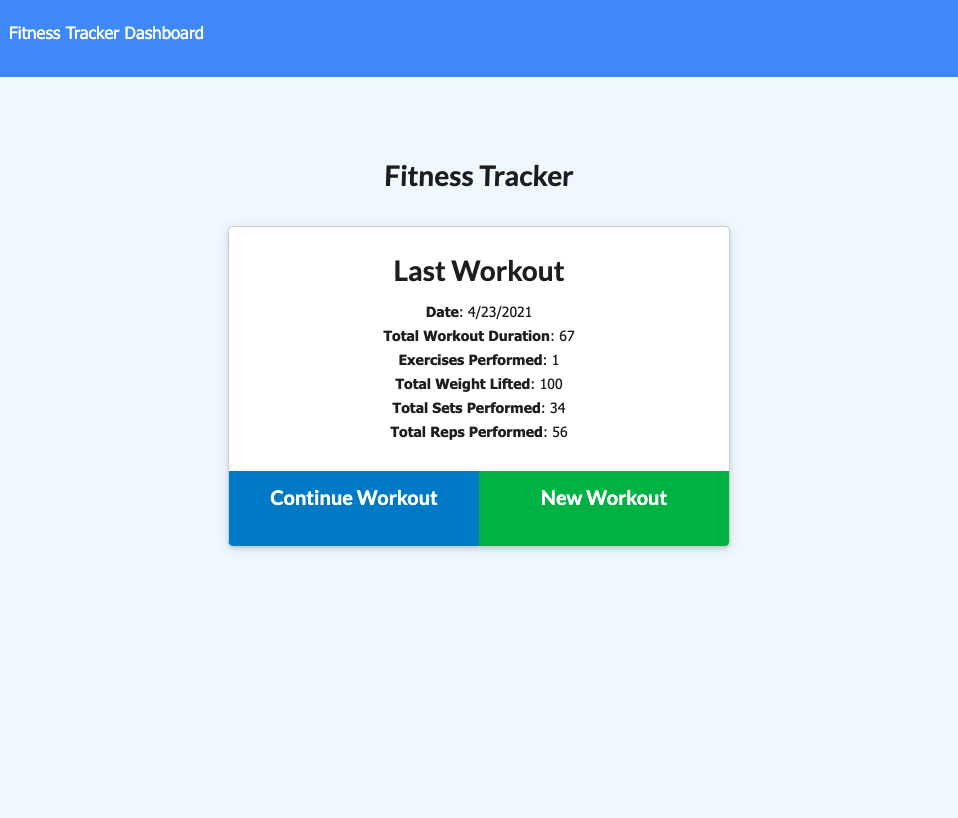
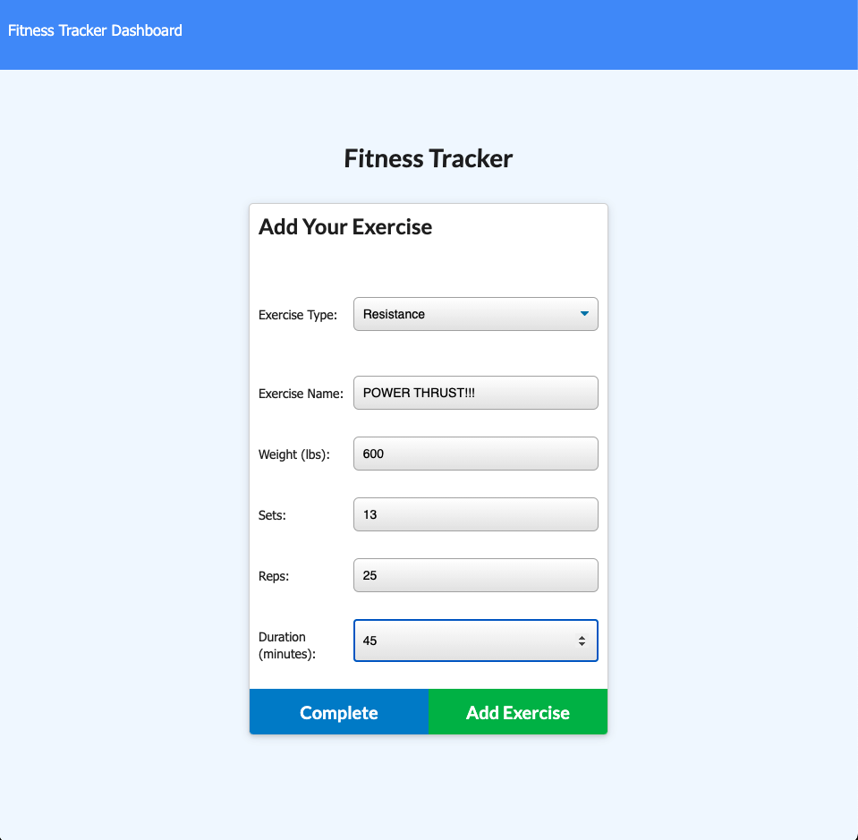
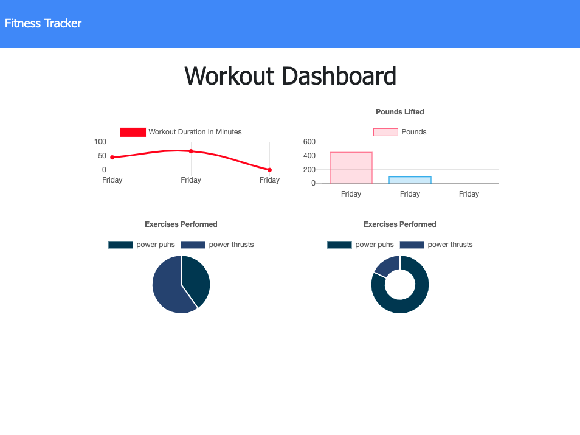

# Workout Tracker

## Description

The motivation for this project was to develope the back-end of an app that tracks the users exercise routines. They can start a new workout routine and then add multiple exersises to that routine which saves different variables to the Mongo DB. This is then used to render different charts with the information displayed. While developing the project i learned basic concepts of using the Mongo Database as well as MongooseJS to access and model the database.

## Usage

You can link to the deployed website [HERE](https://peter-modavis-workout-tracker.herokuapp.com/)

The user can start a new workout.

The user can enter information into individual fields.

The user can track their progress.

## Credits

--[MongoDB](https://www.mongodb.com/what-is-mongodb) 
--[MongooseJS](https://mongoosejs.com/) 
--[ExpressJS](https://expressjs.com/)

## License

Copyright <YEAR> <COPYRIGHT HOLDER>

Permission is hereby granted, free of charge, to any person obtaining a copy of this software and associated documentation files (the "Software"), to deal in the Software without restriction, including without limitation the rights to use, copy, modify, merge, publish, distribute, sublicense, and/or sell copies of the Software, and to permit persons to whom the Software is furnished to do so, subject to the following conditions:

The above copyright notice and this permission notice shall be included in all copies or substantial portions of the Software.

THE SOFTWARE IS PROVIDED "AS IS", WITHOUT WARRANTY OF ANY KIND, EXPRESS OR IMPLIED, INCLUDING BUT NOT LIMITED TO THE WARRANTIES OF MERCHANTABILITY, FITNESS FOR A PARTICULAR PURPOSE AND NONINFRINGEMENT. IN NO EVENT SHALL THE AUTHORS OR COPYRIGHT HOLDERS BE LIABLE FOR ANY CLAIM, DAMAGES OR OTHER LIABILITY, WHETHER IN AN ACTION OF CONTRACT, TORT OR OTHERWISE, ARISING FROM, OUT OF OR IN CONNECTION WITH THE SOFTWARE OR THE USE OR OTHER DEALINGS IN THE SOFTWARE.

## Badges

